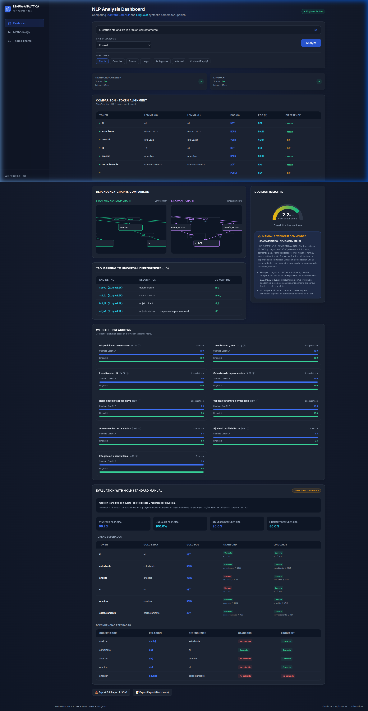
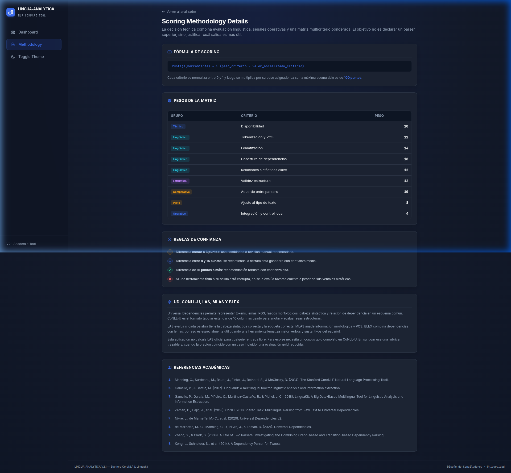

# 📊 LINGUA-ANALYTICA V2.1
### Herramientas de Análisis Sintáctico NLP & Matriz de Decisión Técnica

Prototipo académico desarrollado para el curso **Diseño de Compiladores (INF511)** en la **Universidad de Panamá**.

---

## 🚀 badges

<div align="center">


</div>

---

## 🖥️ Interfaz de Usuario (UI/UX)

La plataforma cuenta con un diseño premium y responsivo al estilo Apple (tanto para escritorio, tablets como móviles), incluyendo visualizaciones de dependencias dinámicas con **Cytoscape.js** y micro-animaciones fluidas de carga:

<div align="center">
  <h3>Vista del Dashboard de Resultados</h3>
  
  
  <br/><br/>
  
  <h3>Vista de la Metodología Académica</h3>
  
</div>

---

## 📝 Descripción del Proyecto

**LINGUA-ANALYTICA V2.1** es una plataforma de evaluación comparativa que analiza y contrasta en tiempo real el rendimiento, precisión y estructura de dos motores de procesamiento de lenguaje natural (NLP) usados en entornos académicos:

* **Stanford Parser / Stanford CoreNLP** (Enfoque local/pesado)
* **Linguakit** empaquetado como servicio HTTP local

El sistema recibe una oración desde una interfaz web, ejecuta el análisis sintáctico en ambos motores, normaliza las estructuras de datos devueltas y genera de forma dinámica una **matriz de decisión automática** que determina cuál herramienta es óptima según las restricciones de los datos de entrada.

La ejecucion normal del sistema es **offline/local**: una vez construidas o descargadas las imagenes de contenedor, la aplicacion no depende de RapidAPI, CDNs ni servicios NLP externos en tiempo de ejecucion. La comunicacion ocurre solamente entre el navegador, el backend Rust y los servicios locales de Stanford CoreNLP y Linguakit. El frontend carga el CSS compilado y las bibliotecas HTMX/Cytoscape desde `static/`.

> **Eje Temático de Investigación:** *Herramientas de Análisis Sintáctico NLP: creación de una matriz de decisión técnica justificando el uso de Stanford Parser o Linguakit según la naturaleza de los datos.*

---

## 🎯 Criterios de Evaluación y Objetivos

El motor de decisión técnica usa una rúbrica multicriterio de 100 puntos. La base lingüística se inspira en **Universal Dependencies**, **CoNLL-U** y métricas de evaluación de parsers como **LAS**, **MLAS** y **BLEX**; la base técnica considera disponibilidad, integración local y reproducibilidad del entorno.

La matriz ya no decide solo por “hay salida / no hay salida”. Cada análisis genera factores ponderados, perfil del texto, diferencia entre herramientas, nivel de confianza y una recomendación con zona de revisión manual.

| Grupo | Criterio | Peso | Propósito académico |
| :--- | :--- | ---: | :--- |
| Técnico | Disponibilidad de ejecución | 10 | Verifica estado OK sin confundir transporte con calidad lingüística. |
| Lingüístico | Tokenización y POS | 12 | Aproxima cobertura de tokens y categorías gramaticales. |
| Lingüístico | Lematización útil | 14 | Se inspira en BLEX para valorar lemas informativos. |
| Lingüístico | Cobertura de dependencias | 18 | Aproxima UAS/LAS sin gold standard. |
| Lingüístico | Relaciones sintácticas clave | 12 | Normaliza relaciones hacia equivalentes UD como `nsubj`, `obj`, `det` y `obl`. |
| Lingüístico | Validez estructural normalizada | 12 | Penaliza arcos vacíos, autodependencias y relaciones no informativas. |
| Académico | Acuerdo entre herramientas | 10 | Usa coincidencia entre parsers como señal de confianza o incertidumbre. |
| Contexto | Ajuste al perfil del texto | 8 | Detecta texto largo, informal, pregunta o posible ambigüedad. |
| Técnico | Integración y control local | 4 | Valora ejecución local y reproducibilidad. |

### Reglas de decisión:
* Si ambas herramientas fallan o la calidad máxima queda por debajo de 35 puntos, el sistema responde **SALIDA INSUFICIENTE / REVISION MANUAL**.
* Si la diferencia es menor a 8 puntos, recomienda **USO COMBINADO / REVISION MANUAL**.
* Si la diferencia está entre 8 y 14.9 puntos, recomienda una herramienta con validación.
* Si la diferencia es de 15 puntos o más, recomienda una herramienta con confianza alta, siempre que no haya señal fuerte de ambigüedad.
* Si el texto es candidato ambiguo, el sistema evita una recomendación cerrada aunque un parser gane por poco.

### Objetivos clave de la matriz:
* Evaluar robustez ante entradas ambiguas, largas, informales o con errores morfosintácticos.
* Hacer trazable la decisión mediante una tabla de factores, pesos y explicación.
* Medir utilidad de la salida estructurada para fases posteriores del compilador: tokenización, parsing, árbol/dependencias y análisis semántico.
* Justificar académicamente el uso de Stanford CoreNLP, Linguakit o revisión combinada según evidencia observable.

### Evidencia visual generada por análisis:
* Comparación token por token: token, lema Stanford, lema Linguakit, POS Stanford, POS Linguakit y diferencia detectada.
* Mapeo de relaciones Linguakit hacia equivalentes aproximados de Universal Dependencies, por ejemplo `SubjL ≈ nsubj`, `DobjR ≈ obj` y `SpecL ≈ det`.
* Árboles/grafos SVG de dependencias para cada herramienta, con nodos, aristas y etiqueta de relación.
* Normalización visual en el grafo de Linguakit: cada arista muestra la relación original y debajo su aproximación UD, por ejemplo `SpecL` y `≈ det`.
* Grafo de construcción de la decisión: entrada, herramientas, normalización, rúbrica ponderada, puntajes y decisión final.
* Evaluación reducida con gold standard manual cuando la oración coincide con casos anotados del proyecto.
* Resumen ejecutivo automático con fortalezas por herramienta, evidencia clave y recomendación final.
* Panel explícito de limitaciones del análisis para evitar conclusiones sobredimensionadas.
* Estado y latencia por herramienta para no ocultar fallos de ejecución.
* Exportación del análisis en JSON y reporte Markdown.
* Casos de prueba reproducibles desde la interfaz para sustentar escenarios simples, largos, ambiguos e informales.

### Gold standard manual incluido

El sistema incorpora un modo de evaluación reducida con 5 oraciones anotadas manualmente. No reemplaza un corpus CoNLL-U completo ni calcula LAS oficial, pero permite defender la matriz con evidencia concreta sobre:

* POS esperado por token.
* Lema esperado por token.
* Relación sintáctica esperada.
* Dependencia esperada entre gobernador y dependiente.

Casos incluidos:

| Caso | Oración | Propósito |
| :--- | :--- | :--- |
| `oracion-simple` | `El estudiante analizo la oracion correctamente.` | Sujeto, objeto directo y modificador adverbial. |
| `ambiguedad-preposicional` | `Vi al hombre con el telescopio.` | Ambigüedad de adjunto preposicional. |
| `texto-formal` | `El informe tecnico describe la arquitectura del sistema.` | Texto formal con sujeto nominal y objeto directo. |
| `progresivo-simple` | `El perro esta corriendo rapidamente.` | Construcción verbal progresiva y adverbio. |
| `objeto-directo` | `La profesora reviso el analisis sintactico.` | Determinantes, sujeto y objeto directo. |

El evaluador maneja alineación básica de contracciones como `al = a + el` y `del = de + el`, porque Linguakit puede segmentarlas en más de un token.

### Limitaciones declaradas por el sistema

Cada análisis muestra un panel de limitaciones. Las principales son:

* No se calcula LAS, MLAS o BLEX oficial sin un corpus gold completo en CoNLL-U.
* El mapeo Linguakit → UD es aproximado y sirve para comparación funcional, no para equivalencia formal perfecta.
* La comparación token por token puede requerir alineación especial en contracciones.
* El sistema recomienda revisión manual cuando detecta ambigüedad, baja diferencia de puntaje o desacuerdo entre parsers.

---

## 🛠️ Arquitectura del Sistema

El proyecto está organizado como un orquestador web en **Rust + Actix Web** y dos servicios NLP aislados en contenedores. La interfaz usa **HTMX** para enviar el formulario a `/analizar` y reemplazar el fragmento de resultados sin una SPA pesada. El backend renderiza plantillas con **Tera**, consulta ambos motores NLP, adapta sus respuestas a modelos internos comunes y entrega la matriz de decisión.

```text
          [ Usuario / Navegador ]
                    |
                    | HTMX POST /analizar
                    v
      [ Actix Web + Tera / app:8080 ]
                    |
          +---------+---------+
          |                   |
          v                   v
 [ Stanford Client ]  [ Linguakit Client ]
          |                   |
          | HTTP POST         | HTTP POST
          v                   v
 [ Stanford CoreNLP ] [ Linguakit API ]
 [ stanford:9000   ] [ linguakit:3002 ]
          |                   |
          +---------+---------+
                    |
                    v
        [ Normalizacion a modelos Rust ]
                    |
                    v
        [ Motor de decision tecnica ]
                    |
                    v
      [ templates/partials/resultado.html ]

```

### Componentes principales

| Componente | Archivo / servicio | Responsabilidad |
| :--- | :--- | :--- |
| Entrada web | `templates/index.html` | Formulario HTMX para capturar texto y tipo de análisis. |
| Rutas HTTP | `src/routes/` | Separa handlers, orquestacion de analisis, grafos, gold cases, tokens y reportes. Expone `/`, `/analizar`, `/api/analizar`, `/api/stanford/local` y `/api/linguakit/local`. |
| Orquestador | `src/main.rs` | Inicializa Actix Web, carga variables `.env` y registra plantillas Tera. |
| Cliente Stanford | `src/stanford_client.rs` | Envía texto a Stanford CoreNLP y extrae tokens, lemas, POS y dependencias. |
| Cliente Linguakit | `src/linguakit_client.rs` | Consulta la API local de Linguakit; si no está disponible, intenta un binario local como fallback. |
| Modelo común | `src/models.rs` | Define estructuras serializables para tokens, dependencias, resultados y decisión. |
| Decisión técnica | `src/decision_engine.rs` | Aplica una matriz ponderada inspirada en UD/CoNLL, calcula perfil del texto, confianza, factores y recomendación. |
| Metodología académica | `templates/metodologia.html` | Documenta fórmula de scoring, pesos, reglas de confianza, UD/CoNLL/LAS/MLAS/BLEX y referencias. |
| Resultado parcial | `templates/partials/resultado.html` | Renderiza comparación token por token, dependencias, mapeo UD, grafos SVG, gold standard, resumen ejecutivo, limitaciones, perfil del texto, desglose ponderado y recomendación final. |

### Topología de contenedores

| Servicio | Imagen | Puerto interno | Puerto host | Compose |
| :--- | :--- | :--- | :--- | :--- |
| `app` | `ghcr.io/raul2811/lingua-analytica` | `8080` | `8080` | `compose.yaml`, `compose.prod.yaml` |
| `stanford` | `ghcr.io/raul2811/lingua-analytica-stanford` | `9000` | `19000` | `compose.yaml`, `compose.prod.yaml`, `compose.tools.yaml` |
| `linguakit` | `ghcr.io/raul2811/lingua-analytica-linguakit` | `3002` | `3002` | `compose.yaml`, `compose.prod.yaml`, `compose.tools.yaml` |

Los contenedores se ejecutan con `read_only`, `tmpfs` para `/tmp`, `no-new-privileges` y `cap_drop: ALL`. En `compose.prod.yaml` tambien usan `restart: unless-stopped`.

---

## 💻 Stack Tecnológico

* **Backend:** [Rust](https://www.rust-lang.org/) con [Actix-Web](https://actix.rs/) (Garantía de concurrencia segura y bajo tiempo de respuesta).
* **Frontend:** HTML5 con estilos CSS inline en plantillas Tera.
* **Interactividad:** [HTMX](https://htmx.org/) (Inyecciones de fragmentos HTML asíncronos para simular una SPA).
* **Integraciones:** `reqwest` (Rust) para consumir los servicios locales de Stanford CoreNLP y Linguakit.
* **Plantillas:** [Tera](https://tera.netlify.app/) para renderizar la vista principal y el parcial de resultados.
* **Contenedores:** Podman / podman-compose con imagenes publicables en GHCR.

---

## 🔗 Herramientas externas utilizadas

Este repositorio contiene una **implementacion propia** de la aplicacion web, el orquestador Rust, los clientes de integracion y la matriz de decision tecnica. Los contenedores de Stanford CoreNLP y Linguakit son una **contenerizacion del trabajo oficial de sus respectivos autores**, preparada para ejecutar ambas herramientas de forma reproducible y offline dentro del proyecto.

Las herramientas externas no se versionan dentro de `tools/`, no se suben archivos `.jar` al repositorio y no se incluyen claves ni API keys. Las imagenes se construyen desde fuentes oficiales durante el proceso de build; despues de ese paso, el analisis se ejecuta localmente sin llamadas a servicios externos.

### Linguakit

Linguakit se utilizo como herramienta NLP desarrollada por ProLNat@GE, CiTIUS, University of Santiago de Compostela. Inicialmente se evaluo el consumo via RapidAPI, pero se opto por la version open source local para evitar dependencia de endpoints externos, permitir ejecucion offline y asegurar reproducibilidad.

- Repositorio oficial: https://github.com/citiususc/Linguakit
- Contenerizacion local: `containers/linguakit/Containerfile`
- Modo de ejecucion usado como referencia:

```bash
./linguakit dep es /tmp/input.txt -a
```

En este proyecto Linguakit se emplea para obtener tokens, lemas, categorias gramaticales y dependencias sintacticas en espanol. El contenedor expone una API HTTP local en el puerto `3002`, consumida por el backend Rust mediante `LINGUAKIT_URL`.

### Stanford CoreNLP

Stanford CoreNLP se utilizo como suite Java de Stanford NLP para tokenizacion, segmentacion de oraciones, analisis sintactico, dependencias y otras tareas NLP. En esta implementacion se ejecuta como servidor HTTP local con modelos en espanol.

- Repositorio oficial: https://github.com/stanfordnlp/CoreNLP
- Pagina oficial de descarga: https://stanfordnlp.github.io/CoreNLP/download.html
- Modelo utilizado: `stanford-corenlp-4.5.10-models-spanish.jar`
- Contenerizacion local: `containers/stanford/Containerfile`

Modo de ejecucion usado como referencia:

```bash
java -mx4g -cp "*" edu.stanford.nlp.pipeline.StanfordCoreNLPServer \
  -serverProperties StanfordCoreNLP-spanish.properties \
  -port 9000 \
  -timeout 15000
```

Stanford CoreNLP se emplea para obtener tokens, lemas, etiquetas POS y dependencias gramaticales en formato JSON. El contenedor expone el puerto interno `9000`; en desarrollo local se publica como `19000` para evitar conflictos con servidores Stanford instalados en el host.

### Nota de licencias

El codigo propio de Lingua Analytica se publica bajo licencia MIT. Stanford CoreNLP y Linguakit mantienen sus licencias y autoria originales; este proyecto solo documenta y automatiza su ejecucion en contenedores para fines academicos y de comparacion tecnica.

---

## ⚙️ Requisitos Previos

Para desarrollar localmente:

1. **Rust Toolchain**
2. **Podman** y **podman-compose** o Docker Compose

No necesitas instalar Java, Stanford CoreNLP ni Linguakit en el host. Esas herramientas se consumen desde imagenes.

---

## 🛠️ Instalación y Despliegue

### 1. Configuración del Entorno (`.env`)

Crea un archivo `.env` en la raíz del proyecto:

```bash
cp .env.example .env
```

Variables principales para desarrollo local con Rust en el host:

```env
APP_HOST=127.0.0.1
APP_PORT=8080
STANFORD_URL=http://localhost:19000
LINGUAKIT_URL=http://localhost:3002
LINGUAKIT_MODE=dep
LINGUAKIT_OUTPUT=-a
```

### 2. Desarrollo local

Levanta solo las herramientas NLP:

```bash
podman-compose -f compose.tools.yaml up -d
```

Alternativa con Docker:

```bash
docker compose -f compose.tools.yaml up -d
```

Ejecuta Rust en el host:

```bash
cargo run
```

Accede a `http://localhost:8080`.

Endpoints de verificación:

```bash
curl -sS "http://localhost:8080/api/stanford/local?texto=Hola%20mundo."
curl -sS "http://localhost:8080/api/linguakit/local?texto=Hola%20mundo."
```

Endpoints principales:

| Ruta | Método | Propósito |
| :--- | :--- | :--- |
| `/` | GET | Interfaz principal con entrada, selector de tipo y casos de prueba. |
| `/analizar` | POST | Devuelve el parcial HTML con la comparación completa. |
| `/api/analizar` | POST | Devuelve el análisis completo en JSON para exportación o pruebas. |
| `/metodologia` | GET | Página académica con fórmula, pesos, reglas, UD/CoNLL/LAS/BLEX y bibliografía. |
| `/api/stanford/local` | GET | Prueba directa del cliente Stanford. |
| `/api/linguakit/local` | GET | Prueba directa del cliente Linguakit. |

### 3. Stack completo local

Ejecuta la aplicación y las herramientas desde imagenes:

```bash
podman-compose up -d
```

### 4. Despliegue completo con GHCR

```bash
GHCR_IMAGE_PREFIX=ghcr.io/raul2811 IMAGE_TAG=main podman-compose -f compose.prod.yaml up -d
```

### 5. Documentacion

Consulta:

- [Desarrollo local](documentacion/desarrollo-local.md)
- [Despliegue GHCR](documentacion/despliegue-ghcr.md)
- [Imagenes y contenedores](documentacion/imagenes-contenedores.md)

## 🧪 Metodología de evaluación

La metodología visible en `/metodologia` resume la base académica de la matriz. La fórmula usada es:

```text
Puntaje(herramienta) = Σ peso_criterio × valor_normalizado_criterio
```

Donde cada criterio se normaliza entre 0 y 1 y luego se multiplica por su peso. La salida final no se decide solo por el mayor número: también se considera diferencia de puntaje, confianza, ambigüedad textual y evidencia complementaria.

### Universal Dependencies y CoNLL-U

Universal Dependencies se usa como marco conceptual para comparar funciones sintácticas entre herramientas. Stanford CoreNLP expone relaciones cercanas a UD como `nsubj`, `obj`, `det`, `obl`, `advmod` y `punct`. Linguakit usa etiquetas propias como `SubjL`, `DobjR`, `SpecL` y `AdjnR`; por eso el sistema muestra un mapeo aproximado hacia UD.

Ejemplos de normalización:

| Linguakit | UD aproximado | Uso en la matriz |
| :--- | :--- | :--- |
| `SubjL` | `nsubj` | Sujeto nominal. |
| `DobjR` / `DobjPrepR` | `obj` | Objeto directo o argumento introducido por preposición. |
| `SpecL` | `det` | Determinante o especificador. |
| `AdjnR` / `CprepR` | `obl` | Adjunto o complemento oblicuo. |

### LAS, MLAS y BLEX

El sistema documenta LAS, MLAS y BLEX como estándar académico de referencia:

* **LAS** evalúa cabeza sintáctica y relación de dependencia.
* **MLAS** añade POS y rasgos morfológicos.
* **BLEX** combina dependencias con lemas.

En esta versión no se calcula LAS oficial para cualquier entrada libre porque eso requiere un corpus gold completo en CoNLL-U. En su lugar, el sistema combina una rúbrica trazable con un gold standard manual reducido para los casos de prueba incluidos.

### Salida de sustentación

Cada análisis produce una explicación defendible:

* Qué herramienta tuvo mejor cobertura sintáctica.
* Qué herramienta produjo mejores lemas en español.
* Qué evidencia token por token sustenta la recomendación.
* Por qué se activa uso combinado o revisión manual.
* Qué limitaciones metodológicas aplican al resultado.

## 📚 Bibliografía y referencias académicas

Manning, C., Surdeanu, M., Bauer, J., Finkel, J., Bethard, S., & McClosky, D. (2014). *The Stanford CoreNLP Natural Language Processing Toolkit*. Proceedings of the 52nd Annual Meeting of the Association for Computational Linguistics: System Demonstrations, 55-60. doi: 10.3115/v1/P14-5010.

Gamallo, P., & Garcia, M. (2017). *LinguaKit: A multilingual tool for linguistic analysis and information extraction*. Linguamática, 9(1), 19-28. doi: 10.21814/lm.9.1.243.

Gamallo, P., Garcia, M., Piñeiro, C., Martínez-Castaño, R., & Pichel, J. C. (2018). *LinguaKit: A Big Data-Based Multilingual Tool for Linguistic Analysis and Information Extraction*. The Fifth International Conference on Social Networks Analysis, Management and Security. doi: 10.1109/SNAMS.2018.8554689.

Zeman, D., Hajič, J., Popel, M., Potthast, M., Straka, M., Ginter, F., Nivre, J., & Petrov, S. (2018). *CoNLL 2018 Shared Task: Multilingual Parsing from Raw Text to Universal Dependencies*. Proceedings of the CoNLL 2018 Shared Task, 1-21. doi: 10.18653/v1/K18-2001.

Nivre, J., de Marneffe, M.-C., Ginter, F., Hajič, J., Manning, C. D., Pyysalo, S., Schuster, S., Tyers, F., & Zeman, D. (2020). *Universal Dependencies v2: An Evergrowing Multilingual Treebank Collection*. Proceedings of LREC 2020.

de Marneffe, M.-C., Manning, C. D., Nivre, J., & Zeman, D. (2021). *Universal Dependencies*. Computational Linguistics, 47(2), 255-308.

Zhang, Y., & Clark, S. (2008). *A Tale of Two Parsers: Investigating and Combining Graph-based and Transition-based Dependency Parsing*. Proceedings of EMNLP 2008, 562-571.

Kong, L., Schneider, N., Swayamdipta, S., Bhatia, A., Dyer, C., & Smith, N. A. (2014). *A Dependency Parser for Tweets*. Proceedings of EMNLP 2014, 1001-1012. doi: 10.3115/v1/D14-1108.

---

## 📄 Licencia

Este proyecto está bajo la Licencia MIT. Consulta el archivo `LICENSE` para más detalles.

---
